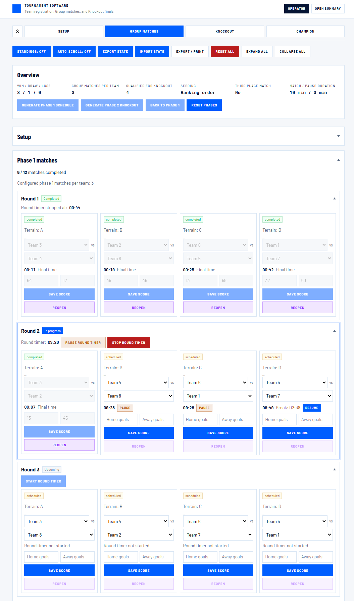
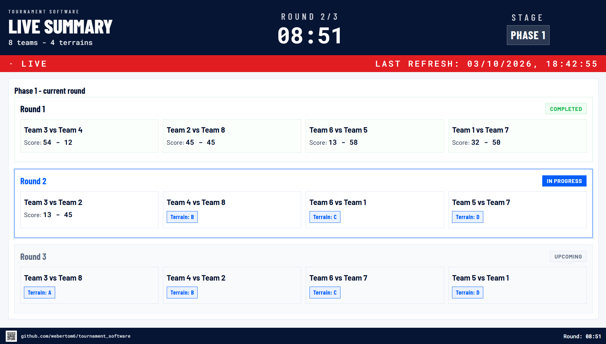
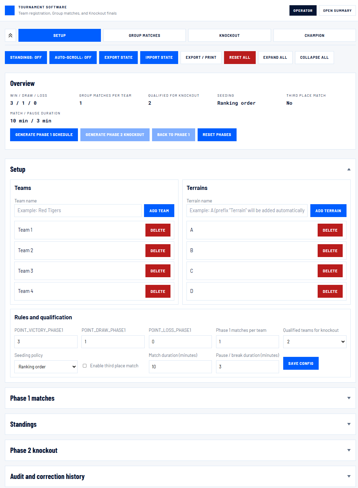
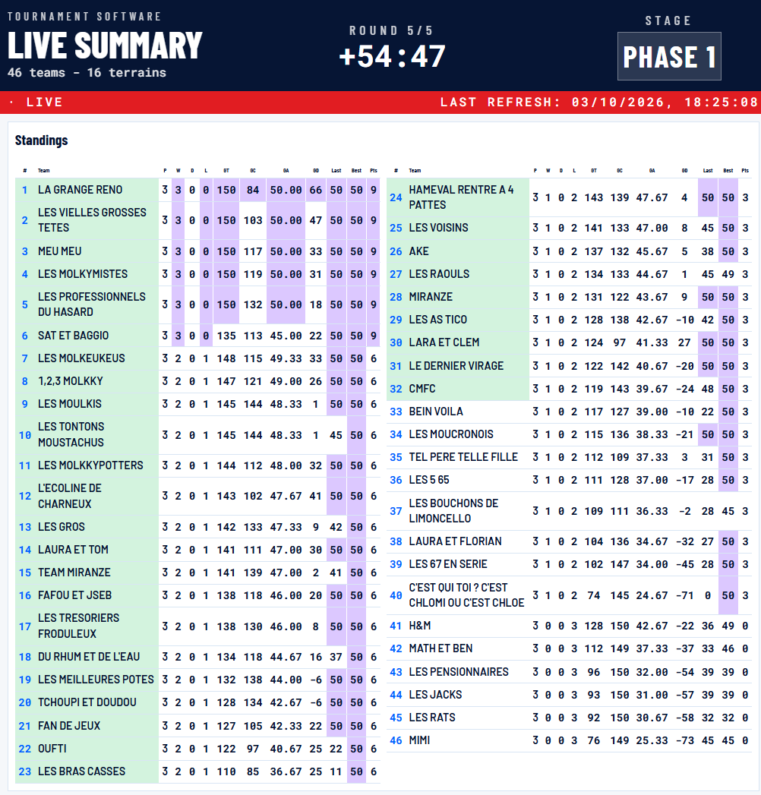
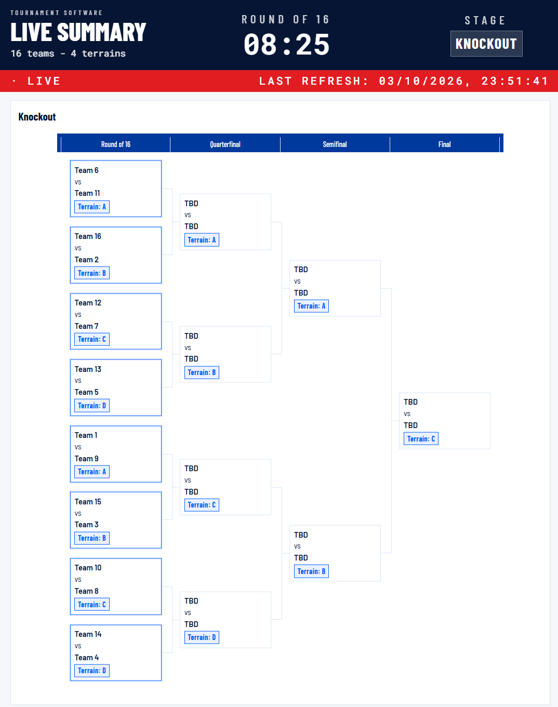
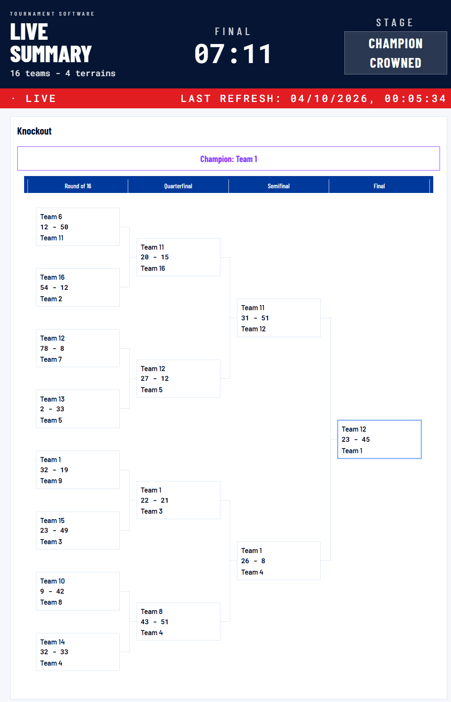

# Tournament Software

```
___________                                                                ____________
\__    ___/_____  ___ __ ________  _____  ______    ______   _____   _____ \__     ___/
  |    |  /  _  \|   |  \\__  __ \/      \\__   \  /      \ / ___ \ /      \  |    |  
  |    | |  (_) ||   |   / |  | \/|    |  \ / __ \_|  Y Y  \\  ___/ |    |  \ |    |  
  |____|  \_____/|______/  |__|   |____|__/(______/|__|_|__/ \_____>|____|__/ |____|  
```

Tool to run a team tournament from a laptop: register teams and
terrains, schedule the group stage, track scores and timers, then generate a
knockout bracket up to the champion. It **runs entirely in the browser**, nothing
is installed and **no needs an internet connection**

The application embeds its own interface fonts and other runtime assets, so
the operator and summary pages keep their intended appearance offline

For the essentials, see [HOW.md](HOW.md): setup, match controls, public display and saving

<p align="center">
  <a href="imgs/visu_operator_phase1.png"></a>
  <a href="imgs/visu_operator_setup.png"></a>
  &nbsp;&nbsp;
</p>
<p align="center"><em>The public screen (right) keeps players informed while the operator manages the tournament in a separate tab (left) - click either image for the full-size view</em></p>

## How to get app and launch it

1. On the GitHub page, click the green "Code" button, then "Download ZIP"
2. Extract the ZIP anywhere on your computer
3. Open `index.html` in a browser: this is the operator screen, used to run
   the tournament
4. Connect your laptop to a big screen or TV or prjector to extand your your desktop
5. Open `summary.html` on new tab and move it on a second screen (TV, projector, tablet): this is
   the read-only screen for players and public, it updates itself

Both files work offline, no install and no server needed

## Visualize quickly the app and use it

### 1 - Set up, then run the group matches

Register teams and terrains, save the rules, then generate the schedule.
During play, the operator controls round timers, enters scores and reopens
matches for corrections

<p align="center">
  <a href="imgs/visu_operator_setup.png"></a>
  &nbsp;&nbsp;
  <a href="imgs/visu_operator_phase1.png"></a>
</p>
<p align="center"><em>Setup (left) and match controls (right) - click either image for the full-size view</em></p>

### 2 - Follow the standings

Saved scores update the rankings automatically. Green rank and team cells
mark the qualifiers; purple cells highlight the best statistics. Large
standings split into columns on the public screen

<p align="center">
  <a href="imgs/visu_summary_standings_tables.png"></a>
</p>
<p align="center"><em>The public standings view - the same columns and highlights are available in printed standings</em></p>

### 3 - Play the knockout through to the champion

Once every group match is completed, generate the knockout bracket.
Winners advance as scores are saved, and the public screen announces the
champion after the final

<p align="center">
  <a href="imgs/visu_summary_ko_r1.png"></a>
  &nbsp;&nbsp;
  <a href="imgs/visu_summary_ko_champion.png"></a>
</p>
<p align="center"><em>Opening round (left) and completed tournament (right) - click either image to inspect the bracket</em></p>

## What to do in the app

- **Register teams and terrains** (playing fields), remove them before the
  tournament starts
- **Set the rules**: points for win/draw/loss, number of matches per team in the
  group stage, power-of-two knockout qualifiers supported by the registered
  teams, seeding (ranked or random),
  optional third place match
- Set the **match duration** and the pause/break duration (just for information of operator, no logic of automatic stops)
- **Auto-generate the group stage schedule**, matches spread across terrains and
  rounds
- Enter scores match by match, standings update by themselves (ranked by
  points, then goal average, goals conceded and team name)
- Start one shared timer per round for every match in it, pause/resume a
  single match if it gets interrupted, see an overtime indicator if a match
  runs past its duration
- Reopen a completed match to correct a mistake
- Search team pickers by typing in phase 1 and the first knockout round;
  choosing an option saves the team immediately and clears that match's old
  score, without completing it. Assigned names are available to browser Find
  (Ctrl+F / F3); manual changes do not automatically rebalance the schedule
- **Auto-generate the knockout bracket randomly or seeding policy** once every group stage match is
  completed
- Run the knockout bracket round by round, with a third place match if
  enabled, up to the champion
- The public summary screen shows a live bracket tree with the current
  round highlighted, and a footer with a QR code and link back to this
  repository plus the live round countdown
- Collapsible sections and a sticky progress bar (Setup > Group Matches >
  Knockout > Champion) make it quick to jump between phases on the
  operator screen
- Save the whole tournament to a file, or load one back
- Print full standings or phase match sheets on A3, A4 or A5 paper
- Reset everything, or only reset the phases while keeping teams, terrains
  and rules
- Remote-control the public screen: show/hide its standings table, start or
  stop it auto-scrolling

## How to run a tournament

1. Press **Reset all** if a previous tournament is still loaded
2. Register the **teams** and **terrains** in the Setup section
3. Fill in the **rules and qualification** form and press **Save config**.
   Nothing is applied until this button is pressed
4. Press **Generate phase 1 schedule**. From this point the rules and the
   team/terrain list are locked; use **Reset phases** if you need to change
   them and redo the schedule
5. For each round, press its **Start round timer** once: it starts the same
   countdown for every match in that round. Enter each match's score as it
   finishes; a running match can be paused if it's interrupted, and a
   completed match can be reopened if a score was entered wrong.
6. Once every group stage match has a score, press **Generate phase 2
   knockout**. Teams are seeded into the bracket from the standings (or
   randomly, depending on the seeding setting)
7. Run the knockout rounds the same way (round timer, scores, reopen if
   needed). The bracket updates itself after every score, and the summary
   screen shows the tree live. The champion is announced once the final is
   completed

## Setup panel buttons

- **Hide/show summary standings**: shows or hides the standings table on the
  public summary screen
- **Start/stop summary auto-scroll**: makes the public summary screen scroll
  up and down on its own, useful when its content doesn't fit the screen.
- **Export state**: downloads a file with the entire tournament (teams,
  terrains, rules, scores). Keep it as a backup or to move to another
  computer
- **Import state**: loads a previously exported file, replacing whatever is
  currently open
- **Export / Print**: allow the user to print the current phase or the standings to print, if no big screen/TV available
- **Reset all**: wipes everything and starts from a blank tournament

## Automated regression tests

The tests run the real JavaScript in fresh, isolated browser-like Node VM
sandboxes. They use only Node built-ins: no install, dependencies, server or
package manager is needed. From the repository root, run:

```sh
node --test --test-concurrency=1 "tests/*.test.js"
```

The files run in order: 00 contracts, 01 state, 02 timer, 03 rules,
04 scheduler, 05 bracket, 06 actions, 07 operator page, 08 summary page,
09 full tournament flow. Run one file by replacing the wildcard with its
filename.

Coverage includes persistence/import/export, validation and reset guards,
standings and tie-breaks, schedule constraints, seeded power-of-two brackets
without new BYEs,
score corrections, timer pauses, page events, print content and read-only
live summary behavior. The full flow exercises 50 teams and a 16-team
knockout, including a corrected quarterfinal and replay from a backup.
Expected results come from handwritten contracts and score tables,
independent standings and invariant checkers, and known seeded outcomes;
they are not snapshots copied from the implementation.

The minimal DOM, clock, storage and dialogs are fakes. Tests do not check
real-browser layout, CSS, actual downloads/printers, device compatibility,
or every malformed legacy file. Known unsupported edge cases are not
asserted as desired behavior. Tests never write tournament files.

Read the final pass/fail counts: a clean run has zero failures, cancelled,
skipped and todo tests. A failure names its case and shows the assertion,
expected/actual values and location. Rerun that file to investigate; change
production behavior only after confirming the intended tournament rule.
